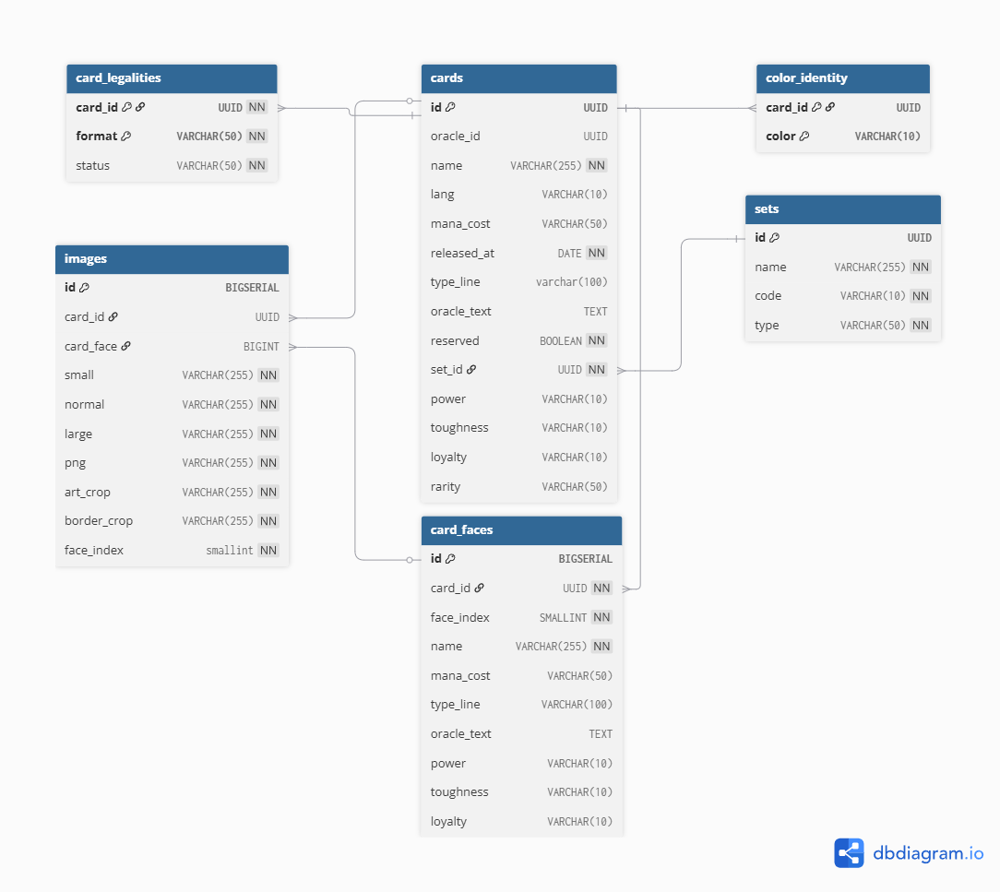

# SpellTrade Batch

A Spring Batch application designed to import and process large Magic: The Gathering datasets from Scryfall into a PostgreSQL database.

The project focuses on high-volume data processing, fault tolerance, and database population using Spring Batch best practices such as chunk-oriented processing, retries, skips, and execution monitoring.

---

## Technologies

- Java 25
- Spring Boot 3
- Spring Batch
- Spring Data JPA
- PostgreSQL
- Flyway
- Docker Compose
- Jackson
- Lombok

---

## Overview

SpellTrade Batch processes Scryfall card data it in a relational database that can be consumed by other applications.

The import pipeline extracts and persists:

- Card Sets
- Cards
- Card Faces
- Images
- Legalities
- Color Identities

---

## Architecture

The application follows Spring Batch's chunk-oriented processing model:

```text
Reader
  ↓
Processor
  ↓
Writer
```

General workflow:

```text
cards.json
    ↓
ScryfallStreamReader
    ↓
Processors
    ↓
Flatten Writers
    ↓
PostgreSQL
```

---

## Processing Flow

### Set Import

Extracts and persists card set information.

```text
cards.json
    ↓
SetProcessor
    ↓
sets
```

### Card Import

Processes and stores the main card information.

```text
cards.json
    ↓
CardProcessor
    ↓
cards
```

### Card Face Import

Processes double-faced and multi-faced cards.

```text
cards.json
    ↓
CardFaceProcessor
    ↓
card_faces
```

### Image Import

Extracts image metadata and URLs.

```text
cards.json
    ↓
ImageProcessor
    ↓
images
```

### Legalities Import

Processes card Legalities information across different formats.

```text
cards.json
    ↓
LegalityProcessor
    ↓
card_legalities
```

### Colors Import

Extract colors from cards.

```text
cards.json
    ↓
ColorIdentityProcessor
    ↓
color_identity
```

---

## Streaming JSON Processing

Instead of loading the entire Scryfall dataset into memory, the application uses a custom streaming reader built with Jackson's `JsonParser`.

This approach allows processing very large JSON files while maintaining a low memory footprint.

```text
Large JSON File
        ↓
Jackson Streaming API
        ↓
One Card at a Time
        ↓
Spring Batch Pipeline
```

---

## Fault Tolerance

The application leverages Spring Batch fault-tolerance features to improve reliability during long-running imports.

### Retry

Transient failures can be automatically retried.

Examples:

- Temporary database connection issues
- Database locking conflicts
- Recoverable infrastructure failures

### Skip

Invalid records can be skipped without stopping the entire job.

Examples:

- Incomplete data
- Constraint violations
- Malformed records

---

## Monitoring

Custom listeners provide execution visibility and logging.

### JobSummaryListener

Logs overall job execution information.

### StepSummaryListener

Logs step-level statistics and execution summaries.

### RetryListener

Tracks retry attempts and retryable failures.

### SkipListeners

Logs skipped records and their associated exceptions.

---

## Database

Database schema versioning is managed using Flyway.

Migrations are executed automatically during application startup.

Migration files are located at:

```text
src/main/resources/db/migration
```

---

## Running with Docker

Start all services:

```bash
docker compose up --build
```

Available services:

| Service    | Port |
|------------|------|
| PostgreSQL | 5432 |
| PgAdmin    | 5050 |

---

## Running Locally

### Prerequisites

- Java 25
- Maven
- PostgreSQL

### Build

```bash
mvn clean package
```

### Run

```bash
mvn spring-boot:run
```

---

## Database Schema

The database is designed to store card information in a normalized relational model.

Main entities:

- Sets
- Cards
- Card Faces
- Images
- Legalitie
- Color Identities

Entity Relationship Diagram:



### Relationships

- A **Set** can contain many **Cards**
- A **Card** belongs to one **Set**
- A **Card** can have multiple **Card Faces**
- A **Card** can have multiple **Images**
- A **Card** can have multiple **Legalities**
- A **Card** can have multiple **Color Identities**

### Special Constraints

#### Images

```sql
CHECK (
    (card_id IS NOT NULL AND card_face IS NULL)
    OR
    (card_id IS NULL AND card_face IS NOT NULL)
)
```

Images can be associated with either a card or a card face.

To preserve data integrity, the database enforces an exclusive relationship:

```text
card_id     card_face
---------------------
NOT NULL    NULL      ✓
NULL        NOT NULL  ✓
NOT NULL    NOT NULL  ✗
NULL        NULL      ✗
```

This constraint guarantees that every image is associated with exactly one owner (either a card or a card face), preventing ambiguous relationships and orphan records.

#### Image Face Positions

```sql
UNIQUE (card_id, face_index)
```

Images associated with a card must have unique face indexes.

To preserve data integrity, the database prevents duplicate image positions for the same card:

```text
card_id     face_index
----------------------
Card A      0          ✓
Card A      1          ✓
Card A      0          ✗
Card B      0          ✓
```

This constraint guarantees that each image position is unique within a card, preventing duplicate image records.


#### Card Faces

```sql
UNIQUE (card_id, face_index)
```

A card cannot have multiple faces with the same face index.

To preserve data integrity, the database enforces a unique face position within each card:

```text
card_id     face_index
----------------------
Card A      0          ✓
Card A      1          ✓
Card A      0          ✗
Card B      0          ✓
```

This constraint guarantees that each face position is unique within a card, preventing duplicate face records.

---

## Project Structure

```text
src/main/java
│
├── batch/
│   ├── listener/
│   │   ├── JobSummaryListener.java
│   │   ├── StepSummaryListener.java
│   │   ├── RetryBatchListener.java
│   │   ├── SkipCardFaceListener.java
│   │   ├── SkipCardListener.java
│   │   ├── SkipColorIdentityListener.java
│   │   ├── SkipLegalityListener.java
│   │   ├── SkipImageListener.java
│   │   └── SkipSetListener.java
│   │
│   ├── processor/
│   │   ├── CardFaceProcessor.java
│   │   ├── CardProcessor.java
│   │   ├── ColorIdentityProcessor.java
│   │   ├── ImageProcessor.java
│   │   ├── SetProcessor.java
│   │   └── LegalityProcessor.java
│   │
│   ├── reader/
│   │   └── ScryfallStreamReader.java
│   │
│   ├── writer/
│   │   ├── CardFaceWriter.java
│   │   ├── CardWriter.java
│   │   ├── ColorIdentityWriter.java
│   │   ├── ImageWriter.java
│   │   ├── SetWriter.java
│   │   └── LegalityWriter.java
│   │
│   └── flatten/
│       ├── CardFaceFlatten.java
│       ├── ColorIdentityFlatten.java
│       ├── ImageFlatten.java
│       └── LegalityFlatten.java
│
├── config/
│   ├── BatchConfig.java
│   ├── JobScheduler.java
│   ├── MapperConfig.java
│   └── step/
│       ├── ColorIdentityStepConfig.java
│       ├── ImageStepConfig.java
│       ├── CardStepConfig.java
│       ├── CardFaceStepConfig.java
│       ├── SetStepConfig.java
│       ├── DownloadCardStepConfig.java
│       └── LegalityStepConfig.java
│
├── domain/
│   ├── entity/
│   │   ├── Card.java
│   │   ├── CardFace.java
│   │   ├── CardFaceJdbc.java
│   │   ├── ColorIdentityJdbc.java
│   │   ├── LegalityJdbc.java
│   │   ├── ImageJdbc.java
│   │   ├── Set.java
│   │   └── SetJdbc.java
│   │
│   ├── enums/
│   │   ├── Color.java
│   │   ├── Legality.java
│   │   ├── LegalityStatus.java
│   │   ├── RarityType.java
│   │   └── SetType.java
│   │
│   └── key/
│      └── CardFaceKey.java
│
├── dto/
│   ├── CardFacesDto.java
│   ├── ImageDto.java
│   └── ScryfallCardDto.java
│
├── mapper/
│   ├── CardFacesMapper.java
│   ├── ImageMapper.java
│   ├── SetMapper.java
│   └── ScryfallCardMapper.java
│
└── repository/
   └── CardFaceRepository.java
```

---

## Features

- High-volume JSON processing
- Custom streaming JSON reader
- Multi-step Spring Batch jobs
- Retry and skip policies
- PostgreSQL persistence
- Flyway database migrations
- Dockerized development environment
- Execution monitoring and logging

---

## Future Improvements

- Unit tests
- Integration tests with Testcontainers
- GitHub Actions CI/CD pipeline
- Micrometer metrics
- Monitoring dashboard

---

## Author

**Marcos**

Developed as a portfolio project to explore Spring Batch, large-scale data processing, fault-tolerant batch jobs, and PostgreSQL integration.